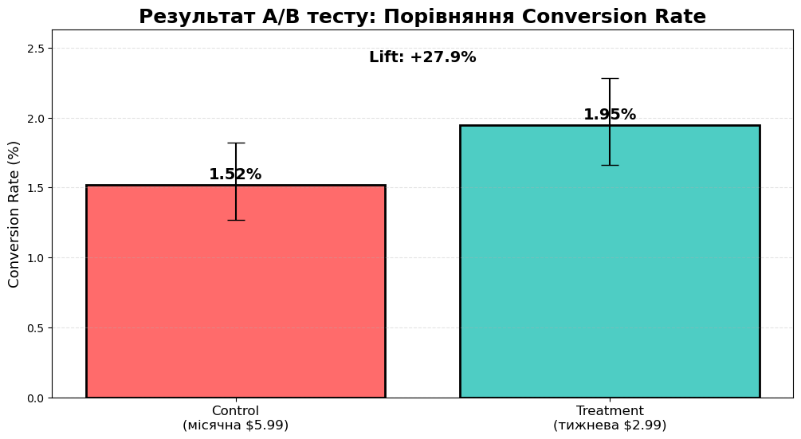
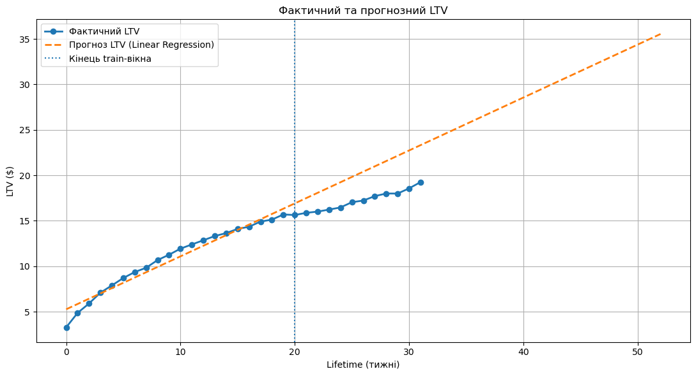

# 📊 Product Analytics Technical Case — A/B Testing & LTV Modeling

### 👩‍💻 Prepared by: Nataliia Yarema  
📧 **Email:** yarema.analytics@gmail.com  
📱 **Phone:** +34 602 576 907  
🔗 **LinkedIn:** [linkedin.com/in/natalia-yarema](https://linkedin.com/in/natalia-yarema)  
💬 **Telegram:** [@Nataliya_Yarema](https://t.me/Nataliya_Yarema)

---

## 🔍 Overview

This repository contains a full-cycle **product analytics case** focused on monetization optimization for a mobile subscription-based application. 
It includes end-to-end product analytics workflow: data cleaning and preparation with Pandas, A/B testing and statistical validation, revenue and monetization analysis, cohort-based LTV modeling, predictive analytics, and business-oriented reporting.

Evaluate whether **weekly subscription pricing ($2.99)** outperforms the **monthly plan ($5.99)** in terms of conversion and revenue.

---

Estimate historical Lifetime Value and predict **52-week LTV** using cohort-based modeling.

---

## 📂 Task Modules

| Module | Description |
|--------|-------------|
| [🧪 A/B Testing](AB_TestTask.ipynb) | Conversion Rate experiment between monthly vs weekly subscription pricing |
| [📑 Executive A/B Testing Reporting](AB_TestTask_Executive_Summary.pdf) | Business-oriented PDF summaries for stakeholders | 
| [📉 LTV Modeling](LTV_Prediction_TestTask.ipynb)| Cohort-based LTV calculation and 52-week prediction |
| [📑 Executive LTV Modeling Reporting](LTV_Prediction_TestTask_Executive_Summary.pdf) | Business-oriented PDF summaries for stakeholders |

---

## 🛠 Tech Stack

- Python (pandas, numpy)  
- matplotlib  
- statsmodels  
- scipy  
- Jupyter Notebook  

---

## 📌 How To Review This Project

Recommended order:

1️⃣ Executive Summary PDFs — quick business overview  
2️⃣ Jupyter Notebooks — full technical analysis   

---

## 📬 Contact

Feel free to reach out via [LinkedIn](https://linkedin.com/in/natalia-yarema) or [Telegram](https://t.me/Nataliya_Yarema) for any questions or clarifications.
